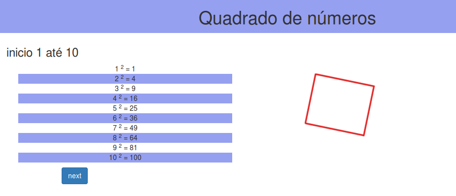

# quadrado-flask


--
This project uses:

Flask<br/>
Bootstrap<br/>
AngularJs

--

\* Run local
```sh
$ git clone https://github.com/alexaleluia12/quadrado-flask.git
$ cd quadrado-flask
$ source venv/bin/activate
$ make run
```
\* Cancel: Ctrl + c<br/>
\* Get out virtualenv: `$ deactivate`

